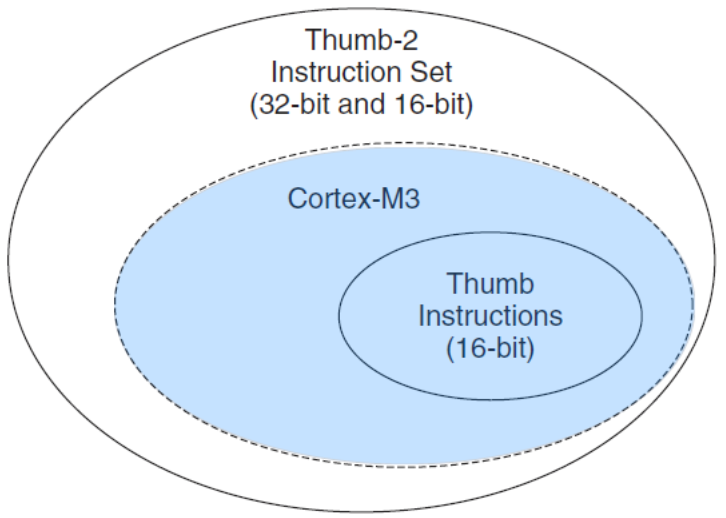
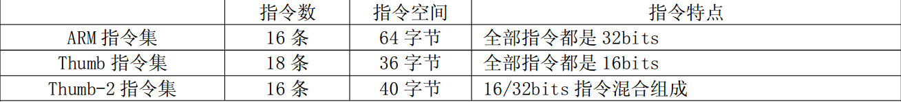
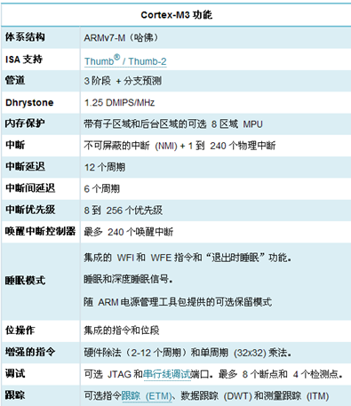
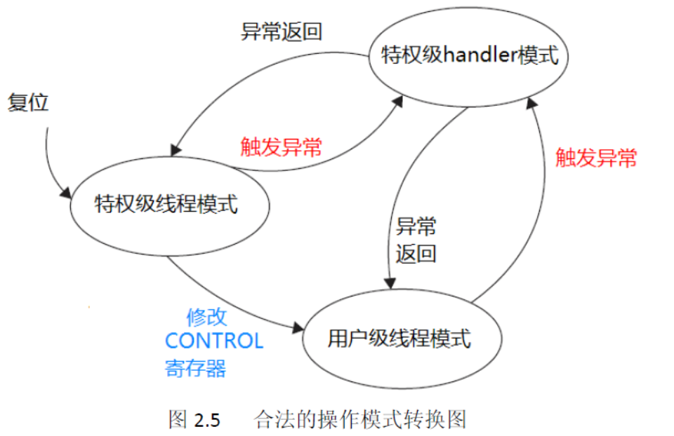
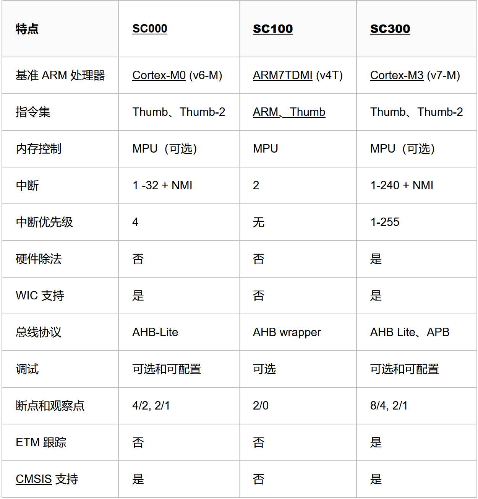
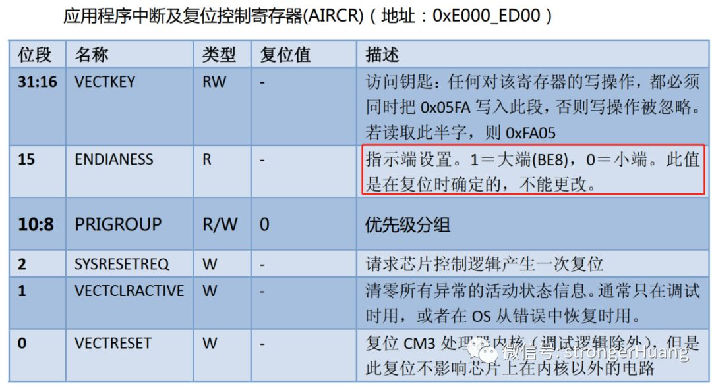
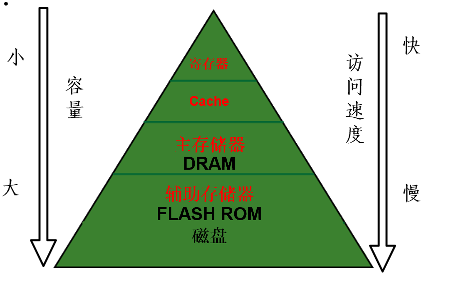
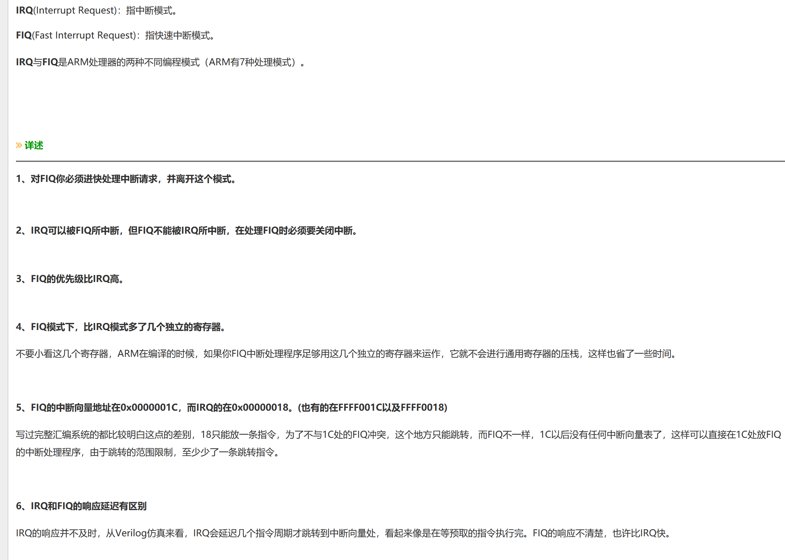

## ARM 架构

- Cortex 系列(ARM新的命名体系)
  - Cortex-A
    > 高性能，丰富的功能
  - Cortex-R
    > 高可靠性，高实时应用
  - Cortex-M
    > 低功耗，代替微控制器(单片机)

- SecureCore

  > 安全应用

- M3、Arm、Thumb指令集

  

  

  - ARM指令集

    > 编代码全部是 32bits 的，每条指令能承载更多的信息，因此使用最少的指令完成功能， 所以在相同频率下运行速度也是最快的， 但也因为每条指令是32bits 的而占用了最多的程序空间

  - Thumb指令集

    > 编代码全部是 16bits 的，每条指令所能承载的信息少，因此它需要使用更多的指令才能完成功能， 因此运行速度慢， 但它也占用了最少的程序空间

  - Thumb-2指令集

    > 在前面两者之间取了一个平衡， 兼有二者的优势， 当一个 操作可以使用一条 32bits指令完成时就使用 32bits 的指令， 加快运行速度， 而当一次操作只需要一条16bits 指令完成时就使用16bits 的指令，节约存储空间
    > 消灭了状态切换的额外开销，节省了执行时间和指令空间。不再需要把源代码文件分成按 ARM 编译的和按Thumb 编译的，软件开发的管理大大减负。无需再反复地求证和测试：究竟该在何时何地切换到何种状态下，我的程序才最有效率。开发软件容易多了。

- Cortex-M3的

  - 架构

  

  - **==中断和异常的处理机制？==**

  - 合法的操作模式转换机制
  
  
  
  - arm处理器支持两种操作模式以及两级特权操作
  
    - 操作模式
  
      - 处理者模式(handler mode)
  
        > 异常服务例程的代码，包括中断服务例程的代码
  
      - 线程模式(thread mode)
  
        > 普通应用程序的代码
  
    - 从用户级到特权级的唯一途径就是异常
  
      > 如果在程序执行过程中触发了一个异常，处理器总是先切换入特权级，并且在异常服务例程执行完毕退出时，返回先前的状态
  
- SC000、SC100、SC300的特点

  - SC000
    - 只占用 8/16 位的空间但却拥有 32 位的性能
    - 具有卓越的能效表现
    - 超低功耗
    - 容易配置
    - 向上兼容二进制的 SC300 处理器
    - 基于流行的Cortex-M0处理器
  - SC100
    - ARM 推出的第一个 SecurCore 处理器
    - 入门级安全解决方案
    - 基于ARM7TDMI
  - SC300
    - 高性能
    - 高功效
    - 容易配置
    - 适用于对安全性和性能要求较高的高端应用
    - 基于Cortex™-M3

  

- ARM存储器
  - ARM存储器默认是小端模式，但是它也支持大端模式(P28)

    

  - **==主存辅存种类？==**

- 存储系统的层次结构

  - 存储器是用来存储信息的部件，是嵌入式系统硬件中的重要组成部分。在复杂的嵌入式系统中，存储器系统的组织结构按作用可以划分为4级(寄存器、Cache、主存储器、辅助存储器)

  

- ARM时钟及电源管理(P101)

- ARM定时技术

  - 定时器结构(P165)
  - 死区发生器作用(P170)
  - **==RTC类型？==**
  - RTC读取(P179)

- ARM中断

  - **独立向量、分组向量、统一向量**

    - 独立向量

      > 每个中断享有独立的入口地址

    - 分组向量

      > 若干中断按组共享组入口地址

    - 统一向量

      > 所有中断共享一个入口地址

  - 普通中断(IRQ)与快速中断(FIQ)(P148)

    

- DMA

  - 源与目的(P190)

  - **==块与字符？==**

  - 中断性能(P189)

    > 中断方式下，CPU需要执行多条指令，占用一定的时间；而DMA传输1字节只占用CPU的1个总线周期，占用CPU的时间少
    >
    > DMA的响应速度比中断快，I/O设备发出中断请求后，CPU要执行完当前指令后才给予响应并且要保护现场，而DMA请求是在总线周期执行完后即可响应

  - 对CPU时序的影响(P193)
