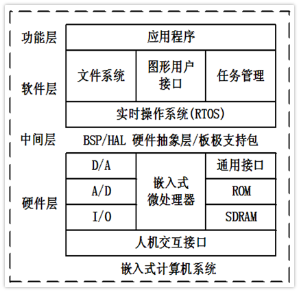
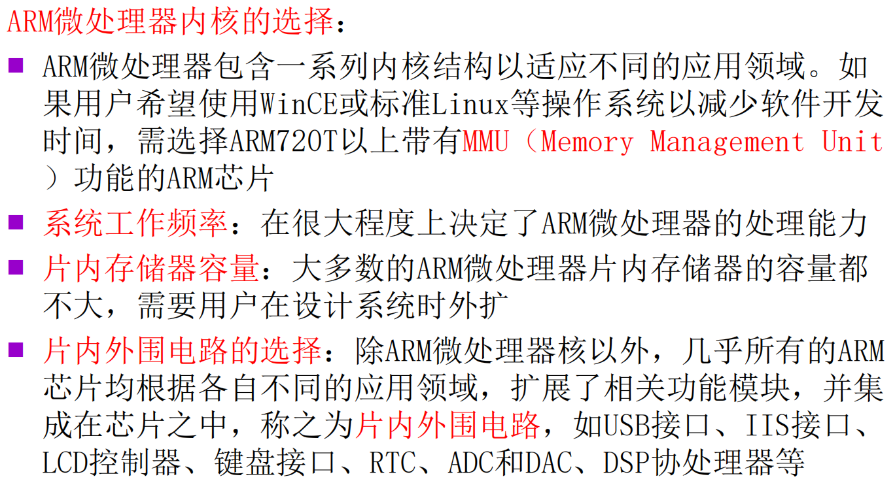
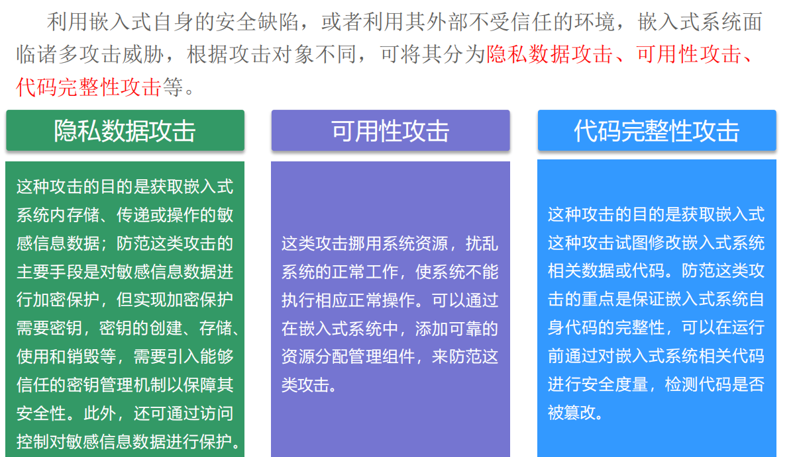
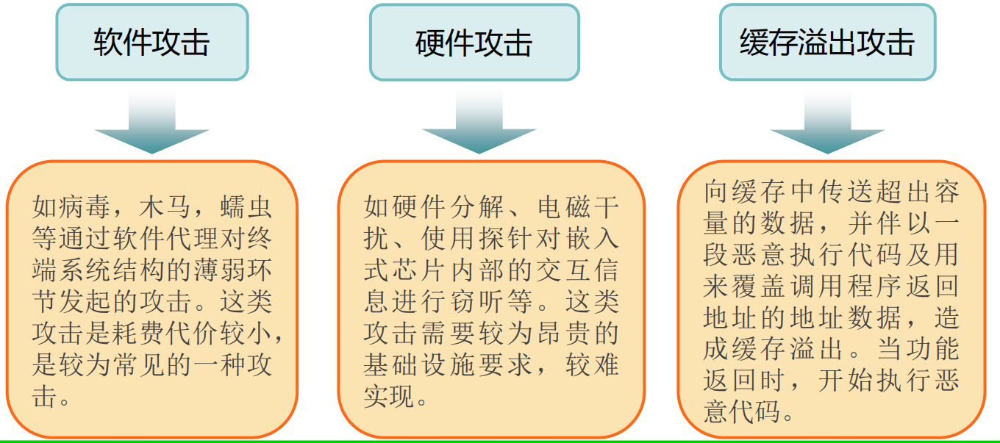

## 嵌入式系统概论

- 嵌入式系统安全 = 可靠 + 安全

- 嵌入式系统的**定义**

  - `IEEE`的定义

    > 嵌入式系统是用于控制、监视或辅助操作机器和设备的装置

  - 一般认为

    > 嵌入式系统是以应用为中心，以计算机技术为基础，并且软/硬件可裁剪，可满足应用系统对功能、可靠性、成本、体积和功耗有严格要求的专用计算机系统

  - 简单的讲

    > 嵌入式系统就是嵌入到对象体系中、用于执行特定功能的专用计算机系统

- 与常见计算机系统的区别
    >嵌入式系统的部件根据主体设备及其应用的需要，嵌入在主体设备内部，不以独立设备的物理形态出现，发挥着运算、处理、存储及控制的作用，是“用于控制、监视或者辅助操作机器和设备的装置”。

- 嵌入式系统的**三要素**

  - 嵌入性

    > 嵌入到对象体系中，有对象环境要求

  - 专用性

    > 软、硬件按对象要求裁剪

  - 计算性

    > 实现对象的智能化功能

- 嵌入式系统**特征**

  - 面向特定应用

    > 具有功耗低、体积小、成本低、高可靠性特点

  - ==**软硬件可裁剪**==
  
    > 最主要特征？
  
  - 较长的生命周期
  
    > 嵌入式系统与具体应用有机结合在一起，升级换代也是同步进行，因此嵌入式系统产品一旦进入市场具有较长的生命周期
  
  - 需要特定的开发工具
  
    > 嵌入式系统本身不具备自主开发能力，必须有一套开发工具和环境才能进行嵌入式开发
    >
    > 例如==仿真机==和==开发器==
  
  - 体积受限
  
    > 硬件和软件都必须高效率的设计，量体裁衣，力争在有限的硅片面积上实现高的性能，完成功能、可靠性、成本和功耗的苛刻要求
  
  - 实时性
  
    > 嵌入式可以设置实时操作系统支持。尽管嵌入式系统的应用程序可以不需要操作系统的支持就能直接运行，但是为了合理地调度多任务，充分利用系统资源，用户可以自行选配实时操作系统开发平台

  - 嵌入式系统中的软件一般都固化在存储器芯片中
  
- 嵌入式系统**组成**

  - 嵌入式系统一般由微处理器、外围支撑硬件、嵌入式实时操作系统(或调度器)、用户应用软件四个部分组成

  - 嵌入式系统由嵌入式硬件与嵌入式软件组成

    > 嵌入式硬件以芯片、模板、组件、控制器形式嵌于设备内部
    >
    > 嵌入式软件包括嵌入式操作系统(或调度器)和各种应用软件，一般固化在ROM或闪存中
    >
    > 软件与外部硬件和设备联系紧密，具有灵活的实用性由于嵌入式系统存储空间有限，**要求软件代码紧凑、可靠，对实时性有严格要求**

- 嵌入式系统的**软件分层**
  

- 嵌入式微处理器

  - 特点

    - 嵌入式微处理器通常把**通用PC机中许多由板卡完成的任务集成到芯片内部**，这样可以大幅减小系统的体积和功耗，具有重量轻、成本低、可靠性的特点

    - 由于嵌入式系统通常应用于比较恶劣的工作环境中，因此嵌入式微处理器在**工作温度、电磁兼容性(EMC)、可靠性**要求方面较高

      > **电磁兼容性二要素**
      > 1. 能在一定的干扰环境下工作
      > 2. 不产生不可容忍的干扰

  - 嵌入式微处理器**分类**
    >按字符宽度分：
    >(8/16/32位、MPU/MCU/DSP/SOC)，8位一般是哈佛结构，成本低，可靠性高。32位一般是冯·诺依曼 /普林斯顿体系结构，成本高，灵活性好
    >按应用的角度分
    >嵌入式微处理器(Embedded Microprocessor Unit,EMPU)
    >嵌入式微控制器(Micro Controller Unit,MCU)
    >嵌入式DSP处理器(Digital Signal Processor,DSP)
    >嵌入式片上系统(System on Chip,SoC)

    - 嵌入式微处理器EMPU(计算处理能力强，接口相对简单)
      >嵌入式微处理器是由通用微处理器演变而来。仅保留与嵌入式应用紧密相关的功能部件，配备必要的外围扩展电路，如存储器扩展电路、I0扩展电路及其他一些专用的接口电路等，以很低的功耗和资源满足嵌入式应用的特殊需求。
      >由于嵌入式系统通常应用于比较恶劣的环境中，因此嵌入式微处理器在工作温度、电磁兼容性以及可靠性方面的要求较高。
      >嵌入式微处理器组成的系统具有体积小、重量轻、成本低、可靠性高的优点。
    - 嵌入式微控制器MCU（接口功能强大，计算处理能力相对弱）
      >又称单片机，它将整个计算机系统集成到一块芯片中
      >一般以某种微处理器内核为核心，根据某些典型的应用，在芯片内部集成了ROM/EPROM、RAM、总线、总线逻辑、定时/计数器、看门狗、I/0、串行口、脉宽调制输出、A/D、D/A、Flash ROM、EEPROM等各种必要功能部件和外设
      >为适应不同的应用需求，可对功能的设置和外设的配置进行必要的修改和裁减定制，使得一个系列的单片机具有多种衍生产品，每种衍生产品的处理器内核都相同，只是存储器和外设的配置及功能的设置不同。这样可以使单片机最大限度地和应用需求相匹配，从而减少整个系统的功耗和成本
      >和嵌入式微处理器相比，微控制器的单片化使应用系统的体积大大减小，从而使功耗和成本大幅度下降，可靠性提高
    - 嵌入式DSP处理器(处理连续的数据流)
      >在数字信号处理应用中，各种数字信号处理算法相当复杂，一般结构的处理器无法实时地完成这些运算.由于DSP处理器对系统结构和指令进行了特殊设计，因此它更适合于实时地进行数字信号处理。
      >在数字滤波、FFT(fast Fourier transform)、频谱分析等方面，DSP应用正从在通用单片机中以普通指令实现DSP功能，过渡到采用嵌入式DSP处理器。
      >在有关智能方面的应用中，也需要嵌入式DSP处理器，例如各种带有智能逻辑的消费类产品，生物信息识别终端，带有加/解密算法的键盘，ADSL接入，实时语音压缩解压系统，虚拟现实显示等。这类智能化算法一般运算量都较大，特别是向量运算、指针线性寻址等较多，而这些正是DSP处理器的优势所在。
      >嵌入式DSP处理器有两类：一是DSP处理器经过单片化、EMC改造、增加片上外设成为嵌入式DSP;二是在通用单片机或片上系统中增加DSP协处理器。
      >嵌入式DSP处理器的设计者通常把重点放在处理连续的数据流上。如果嵌入式应用中强调对连续的数据流的处理及高精度复杂运算，则应该优先考虑选用DSP器件。

    - 嵌入式片上系统S0C(软硬件一体化的专用产品)
      >随着VLSI设计的普及和半导体工艺的迅速发展，可以在一块硅片上实现一个更为复杂的系统，这就是片上系统(SoC)各种通用处理器内核和其他外围设备都将成为SoC设计公司的标准库中的器件，用标准的DL等硬件描述语言描述，用户只需定义出整个应用系统，仿真通过后就可以将设计图交给半导体工厂制作芯片样品
      >这样，整个嵌入式系统大部分都可以集成到一块芯片中去，应用系统的电路板将变得很简洁，这将有利于减小体积和功耗，提高系统的可靠性

  - 体系结构

    - 冯·诺伊曼(普林斯顿)体系结构
      - 程序存储器和数据存储器公用一个存储空间，**统一编址**
      - 采用统一的地址及数据总线，指令和数据的宽度相同
      - 使用灵活(例如代码远程更新OTA)
    - 哈佛体系结构
      - 程序存储器和数据存储器是**独立编址**的两个存储空间
      - 分离的**程序总线**和**数据总线**可允许一个机器周期内同时获取指令码(程序存储器)和操作数(数据存储器)，从而**提高执行速度和数据的吞吐率，可靠性高(大部分程序存储器是只读存储器)**

  - 指令系统

    - 复杂指令集系统(CISC)

      - 采用CISC体系结构的计算机**各种指令的使用频率相差悬殊**，大概有**20%的比较简单的指令被反复使用**，使用量约占整个程序的80%；而有80%左右的指令则很少使用，其使用量约占整个程序的20%，即**指令的2/8规律**
      - 在CISC中，为了支持目标程序的优化，支持高级语言的编译程序，增加了许多复杂的指令，用一条指令来代替一串指令，**简化了软件设计，却增加了硬件的复杂程度，而且这些复杂指令并不等于有利于缩短程序的执行时间**
      - 在VLSI制造工艺中要求CPU控制逻辑具有规整性，而**CISC为了实现大量复杂的指令，控制逻辑极不规整，给VLSI工艺造成了很大困难**

    - 精简指令集系统(RISC)

      - RISC是在CISC的基础上产生并发展起来的
      - RISC简化指令系统使计算机的结构更加简单合理，提高运算效率
      - **优先选取使用频率高的、很有用但不复杂的指令**，避免使用复杂指令
      - **固定指令长度，减少指令格式和寻址方式种类**
      - 指令之间各字段的划分比较一致，各字段的功能也比较规整
      - 采用Load/Store指令访问存储器，其余指令都在寄存器之间进行
      - 增加通用寄存器数量，算数/逻辑运算的操作数都在寄存器中存取
      - **大部分指令控制在一个或小于一个机器周期内完成**
      - **以硬布线控制逻辑为主，不用或少用微码控制**

    - CISC和RISC的主要差异

      - 指令系统

        > RISC设计者把主要精力放在那些经常使用的指令上，尽量使它们具有简单高效的特色。对不常用的功能，常通过组合指令来实现。而CISC的指令系统比较丰富，有专用指令来完成特定的功能

      - 存储器操作

        > RISC对存储器操作有限制，使控制简单化；而CISC机器的存储器操作指令多，操作直接

      - 程序

        > RISC汇编语言程序一般需要较大的内存空间，实现特殊功能时程序复杂，不易设计；而CISC汇编语言程序编程相对简单，科学计算及复杂操作的程序设计相对容易，效率较高

      - CPU

        > 由于RISC CPU包含较少的单元电路，因而面积小、功耗低；而CISC CPU包含丰富的电路单元，因而功能强、面积大、功耗大

      - 设计周期

        > RISC微处理器结构简单，布局紧凑，设计周期短，且易于采用最新技术；CISC微处理器结构复杂，设计周期长

      - 易用性

        > RISC微处理器结构简单，指令规整，性能容易把握，易学易用；CISC微处理器结构复杂，功能强大，实现特殊功能容易

      - 应用范围

        > RISC更适用于嵌入式系统；而CISC则更适合于通用计算机
  - ARM嵌入式微处理器
    - 应用领域
      >工业控制：作为32位的RISC架构，基于ARM核的微控制器芯片不但占据了高端微控制器市场的大部分市场份额，同时也逐渐向低端微控制器应用领域扩展，ARM微控制器的低功耗、高性价比，向传统的8位/16位微控制器提出了挑战
      >无线通讯：日前已有超过85%的无线通讯设备采用了ARM技术，ARM以其高性能和低成本，在该领域的地位日益巩固。
      >网络系统：采用ARM技术的ADSL(Asymmetric digital subscriber line)芯片正逐步获得竞争优势
      >ARM在语音及视频处理上进行了优化，对DSP的应用领域提出了挑战消费类电子产品：ARM技术在目前流行的数字音频播放器、数字机项盒和游戏机中得到广泛采用。
      >成像和安全产品：现在流行的数码相机和打印机中绝大部分采用ARM技术。手机中的32位SIM智能卡也采用了ARM技术
    - 特点
      >体积小，低功耗，低成本，高性能；
      >支持Thumb(16位)/ARM(32位)双指令集，兼容8位/16位器件；
      >使用单周期指令，指令简洁、规整：大量使用寄存器，大多数数据操作都在寄存器中完成，只有加载/存储指令可以访问存储器，以提高指令的执行效率；
      >寻址方式简单灵活，执行效率高；
      >固定长度的指令格式
    - 各系列产品
      - ARM7
        >优化了用于对价位和功耗敏感的消费应用的低功耗32位核
        >嵌入式ICE-RT(In Circuit Emulation-Real Time)逻辑
        >三级流水线和冯·诺依曼体系结构，提供0.9MIPS/Mz(Million instructions Iper second)。流水线是RISC处理器执行指令时采用的机制。使用流水线，可以在取下一条指令的同时译码和执行其他指令，从而加速指令的执行。可以把流水线想象成汽车生产线，每个阶段只完成一项专门的生产任务
        >ARM7的三级流水线:取指(Fetch)：从存储器中装载一条指令；译码(Decode):识别将被执行的指令；执行(Execute):处理指令并把结果写回到寄存器
      - ARM9
        >ARM9系列，提供高性能和低功耗领先的硬宏单元
        >5级流水线
        >哈佛体系结构提供1.1MTPS/MHz
        >ARM92OT和ARM922T内置MMU(Management Memory Unit)、指令和数据cache和高速总线接口。ARM940T内置指令和数据cache、保护单元和高速AMBA(AMBA:AdvancedMicrocontroller Bus Architecture)总线接口
        >ARM9E系列是一种可综合处理器，带有DSP扩充和紧耦合存储器/紧致内存(TCM)接口，使存储器以完全的处理器速度运行,可直接连接到内核上
      - ARM10系列
        >64位AB指令和数据接口；
        >6级流水线；
        >1.25MIPS/MHz;
        >与同等的ARM9器件相比，其性能提高50%
      - ARM11系列
        >提供了两种新型节能方式，功耗更小
      - Cortex系列(ARM新的命名体系)
        >Cortex-A:高性能，丰富的功能
        >Cortex-R:高可靠性，高实时应用
        >Cortex-M:低功耗，代替微控制器（单片机）
      - SecurCore
        >安全应用
    - 嵌入式微处理器选型
    

- 嵌入式系统的**外围硬件设备**
  >嵌入式硬件系统通常是一个以嵌入式微处理器为中心，包含有电源、时钟、复位、输入输出及驱动、存储、其他电路模块，其中操作系统和应用程序都固化在模块的ROM/F1ash/0TP中。
  >外围硬件设备指在嵌入式硬件系统中，除微处理器外的完成输入、输出、存储、显示、通信、调试等部件及电源。
  >根据外围硬件设备的功能可分为存储器(SRAM、DRAM、Flash、E2PROM、OTP、ROM等)和输入输出接口(GPIO口、串口、红外接口、I2C、I2S、USB、CAN、Ethernet、LCD、键盘、触摸屏(键)、A/D、D/A、RTC、CAP、PWM等)两大类

- 嵌入式系统的**操作系统**
  >由于存储器容量有限，嵌入式操作系统内核通常较小
  >嵌入式操作系统，都有一个内核（Kernel）和一些系统服务(System Service)。嵌入式操作系统必须提供一些系统服务供应用程序调用，包括内存分配、I/0存取、中断、任务、定时、延时、信号量、互斥量、邮箱、消息、消息队列、事件组等服务等,文件系统、设备驱动程序则是建立在I/0存取和中断服务基础之上的，有些嵌入式操作系统也提供多种通信协议以及用户接口函数库等。
  >嵌入式操作系统的性能通常取决于内核程序，而内核的工作主要在任务管理(Task Management)、任务调度(Task Scheduling)、进程间通信(IPC)
  >嵌入式操作系统不是必需的。操作系统带来了不确定性，不可测试性，降低了系统的可靠性.只有对实时性有高要求时才会考虑操作系统
  >常见嵌入式操作系统有：Linux、Windows CE、uC/OS、Palm OS和VxWorks等

- 常用存储器

  |        | **==开发成本==？** | **制造成本** | **可靠性** | **可修改性** | **产品周期** | **功耗** |
  | ------ | ------------------ | ------------ | ---------- | ------------ | ------------ | -------- |
  | ROM    | 高                 | 低           | 高         | 无           | 长           | 低       |
  | OTP    | 中                 | 中           | 中         | 无           | 短           | 中       |
  | FLASH  | 低                 | 高           | 低         | 有           | 短           | 高       |
  | E2PROM | 低                 | 高           | 中         | 有           | 短           | 高       |

  - ROM(Read-Only Memory)

    > 以非破坏性读出方式工作，只能读出无法写入信息。信息一旦写入后就固定下来，即使切断电源，信息也不会丢失

  - OTP(One Time Programmable)

    > 一次性可编程存储器，程序烧入单片机后，将不可再次更改和清除

  - Flash

    > 在没有电流供应的条件下也能够长久地保持数据，其存储特性相当于硬盘

  - E2PROM

    > 电可擦除可编程只读存储器，是一种掉电后数据不丢失的存储芯片

- 嵌入式系统的**应用软件**
  >设计人员针对专门的应用领域而设计的应用程序
  >把嵌入式操作系统和应用软件组合在一起，作为一个有机整体
  - **嵌入式系统软件的要求与PC机有所不同**，其主要特点有

    - 软件**固化**存储，修改不易，要有较高的正确率与可靠性
    - 软件代码要求**精简**(受成本、体积和功耗存储空间限制)、**高效**(受主频、功耗限制)、**高可靠性**(容错)

    - **数据结构简洁**(代码优化时，数据结构占80%，编程技巧占20%)

- 嵌入式系统安全
  - 安全挑战
    >除了传统的僵尸网络以及嵌入式木马程序与后门，还有针对嵌入式系统的缓冲区溢出攻击以及注入代码攻击，ROP(Return--oriented programming)攻击，旁路攻击，近年来还出现的攻击嵌入式系统的震网病毒、火焰病毒、Dugu病毒，影响了公共交通工业控制、能源、军工等重要基础行业，对资源环境、基础设施以及生命财产造成巨大威胁。
  - 安全事件
    >波兰城市轨道交通脱轨事件
    >Stuxnet震网病毒
    >美国伊利诺伊州水利供水系统受损
    >Havex病毒
    >BlackEnergy恶意软件
    >手机病毒幽灵推
  - 攻击分类
    - 根据攻击对象分类
        
    - 根据发起攻击的代理工具或手段分类
        
  - 防护
    - 软件增强,使用嵌入式安全操作系统
        >安全操作系统通过参照监视器监视系统的运行，防止违反安全策略的动作产生，当前嵌入式安全操作系统一般都具备身份认证、自主访问控制和安全审计等功能。第四代防火墙的设计以这种安全操作系统为基础。
    - 硬件增强,增添加密运算模块
        >使用应用程序特定的集成电路(ASIC)在硬件上实现给定的加密算法，只需要很少的成本且可批量生产。
    - 硬件增强，添加专用安全存储模块
        >参考PC端可信计算思想，在嵌入式系统中添加一个专用的安全硬件模块，并将敏感数据保护在一个安全设计十分牢靠的物理设备中，可采用以下几种先进技术。防篡改技术物理安全技术硅工艺技术
    - 架构设计增强
        >引入TrustZone架构,从体系架构角度出发，引入TrustZone架构增强嵌入式系统安全。TrustZone提供硬件隔离，在尽量不影响原有处理器设计的情况下保护安全内存、加密块、键盘和显示器等外设。
