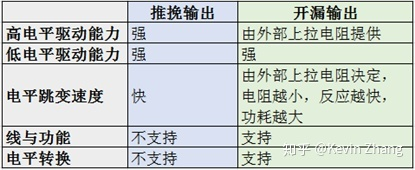

## 硬件基础知识

- 电源电压

  > Type A: +5V;	Type B: +3.3V;	Type C: +1.8V

- 电源范围

  > 一般为 $\pm$10%，部分芯片 $\pm$5%
  >
  > 宽电压范围芯片适用性好，可简化电源设计

- 与电源相关的概念

  - 电源纹波
  
    > 电源纹波是在电源中，存在大量可以很轻松地与探针耦合的高速、大信号电压和电流波形，其中包括耦合自电源变压器的磁场，耦合自开关节点的电场，以及由变压器互绕电容产生的共模电流。
    >
    > 纹波是由于直流稳定电源的电压波动而造成的一种现象，因为直流稳定电源一般是由交流电源经整流稳压等环节而形成的，这就不可避免地在直流稳定量中多少带有一些交流成份，这种叠加在直流稳定量上的交流分量就称之为纹波。纹波的成分较为复杂，它的形态一般为频率高于工频的类似正弦波的谐波，另一种则是宽度很窄的脉冲波
    >
    > 危害
    >
    > 1. 容易在用电器上产生谐波
    > 2. 降低电源的效率
    > 3. 会干扰数字电路的逻辑关系，影响其正常工作
    >
    > 解决方法
    >
    > 1. 在成本、体积允许的情况下，尽可能采用全波或三相全波整流电路
    > 2. 加大滤波电路中电容容量，条件许可时使用效果更好的LC滤波电路
    > 3. 使用效果好的稳压电路，对纹波抑制要求很高的地方使用模拟稳压电源而不使用开关电源
  
  - 电源滤波
  
    > 对特定频率的频点或该频点以外的频率进行有效滤除，得到所需要的有效信号
  
  - 掉电检测和数据撕裂
  
    > 数据撕裂
    >
    > - 大于CPU位宽的数据、大于CPU位宽的定时器访问
    >
    > 如何解决：修改原始数据之前先建立备份
    >
    > > 需要考虑的问题
    > >
    > > - 备份区的使用寿命
    
  - 运行模式
  
    - 运行
      - 所有芯片都工作、功耗大
    - 待机
      - 让某一些部件工作，某一些部件不工作
      - 通过中断可回到运行
    - 掉电
      - 所有电路都不工作
      - 只能通过复位回到运行
  
- 振荡器
  
  - CPU 工作最原始的信号源
  
  - 分类

    - 内部
  
      - 优点：便宜、体积小
      - 缺点：不准确
  
    - 外部
  
      - 种类
  
        > - RC
        >   $$
        >   T = RC = \cfrac{1}{2\pi f_c}
        >   $$
        >
        >
        >   - 优点：**永远会工作**；成本低，不超过1角
        >   - 缺点：及其不准
        > - 陶瓷
        >
        >  - 优点：精度高；相比于晶体更便宜，2角左右
        >   - 缺点：成品率低；启动困难
        > - 晶体
        >
        >   - 缺点：成本高，6角左右
        >  - 优点：精度比陶瓷更高；成品率高；启动困难
        > - EC
  
      - 双振荡器
  
        - RC振荡器保证起振
        - 陶瓷/晶体振荡器工作
  
  - 时钟占空比 $1:1$
  
    - 采用模 $2$ 运算或者锁相环
  
  - 时钟分频与分配
  
    - 总线时钟
    - 部件时钟
  
  - 指令周期与时钟周期
  
    - 应用关心的是指令周期
  
  - 震荡器控制
  
    - 频率选择
  
    - 状态锁定位
  
    - 状态稳定位
  
      > 1. 选择振荡器
      > 2. 等待振荡器稳定
      > 3. 切换
  
- 复位电平要求
  $$
  H \ge 80\% Vcc \\
  L \le 12\% Vcc
  $$

- 通用电口电平要求
  $$
  H \ge 70\% Vcc \\
  L \le 30\% Vcc
  $$

- 信号上升时间

  > $10 \% Vcc$ 上升到 $90 \% Vcc$ 所需要的时间
  >
  > 上升时间往往更慢

- 信号下降时间

  > $90 \% Vcc$ 下降到 $10 \% Vcc$ 所需要的时间

- **好的信号要求信号上升时间和信号下降时间不超过信号周期的 $4 \%$**

- 如何解决信号不好的问题

  1. 增加信号周期(降低时钟频率)
  2. 更换硬件
  
- 推挽输出

  - 功耗大、驱动能力达、信号快
  
  - 需要考虑集肤效应
  
    > 导体中有交流电或者交变电磁场时，导体内部的电流分不均匀的一种现象，随着与导体表面的距离逐渐增加，导体内的电流密度呈指数衰减，即导体内的电流会集中在导体的表面
  
  - 常用于板内
  
    > 不容易形成短路
  
- OC/OD开漏输出

  - 常用于板间

- 推挽输出与开漏输出

  

- 功耗控制
  $$
  P = K f^2
  $$

  - 对于固定硬件 $K$ 可以看作是一个常数
  - 控制功耗的方法
    1. 关闭不必要的时钟，保留中断时钟(停止时钟还可以**规避干扰**)
    2. 低电压供电

- 死机的本质

  - 只要有时钟，硬件本身不会死机
  - 程序没有按照代码流程执行(例如PC指针错误)

- 如何提高可靠性

  - 使用看门狗(WDT)

    - 实质上是一个定时计数器
    - 正常情况下可通过程序发出的清除指令清零
    - 如果出现死机会造成溢出，导致复位
    - 种类
      - 传统 WDT
        - 只有上限
      - 窗口 WDT
        - 有下限和上限

    - 硬件看门狗和软件看门狗

      > 硬件看门狗是利用一个定时器电路，其定时输出连接到电路的复位端，程序在一定时间范围内对定时器清零(俗称“喂狗”)，因此程序正常工作时，定时器总不能溢出，也就不能产生复位信号。如果程序出现故障，不在定时周期内复位看门狗，就使得看门狗定时器溢出产生复位信号并重启系统。软件看门狗原理上一样，只是将硬件电路上的定时器用处理器的内部定时器代替，这样可以简化硬件电路设计，但在可靠性方面不如硬件定时器，比如系统内部定时器自身发生故障就无法检测到。当然也有通过双定时器相互监视，这不仅加大系统开销，也不能解决全部问题，比如中断系统故障导致定时器中断失效

  - 没事时休眠

  - 利用内存可靠性高于端口的特点对

    - 输入：周期性重复配置与滤波
    - 输出：利用端口数据备份周期性刷新内容(先)与配置(后)

- 如何判断冷、热启动

  - 利用RAM特性(上电随机、复位不受影响)建立标志区，写入关键字，通过比较关键字来区分冷热启动